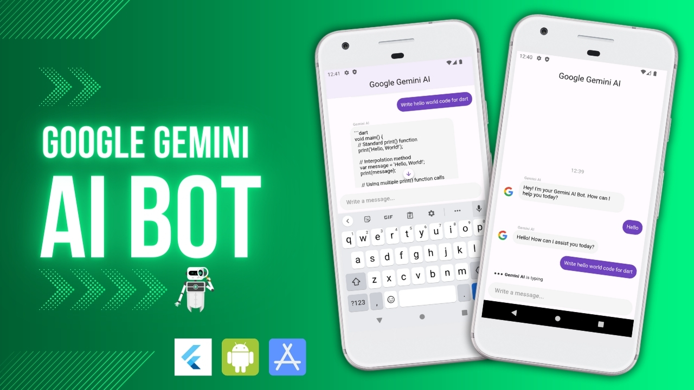
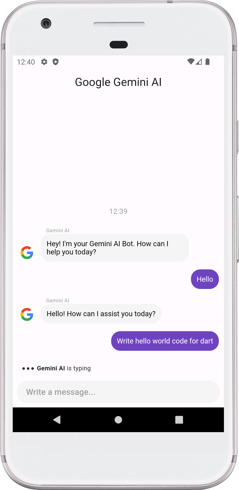
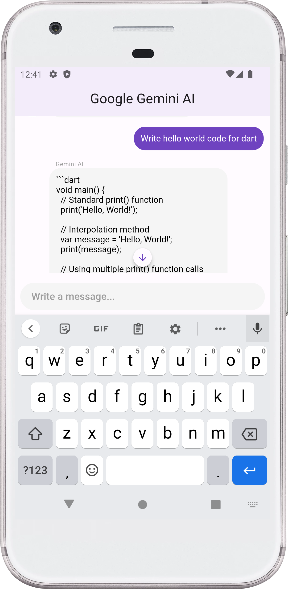

# GeminiChat - Intelligent Conversations with Google Gemini AI

Welcome to GeminiChat, your gateway to intelligent and engaging conversations! This Flutter app is seamlessly powered by the Google Gemini AI API, offering an immersive chat bot experience.

## Key Features:

- **Smart Conversations:** Engage in intelligent and context-aware chats with Gemini AI.
- **User-Friendly Interface:** Enjoy a sleek and user-friendly chat interface for a seamless experience.
- **Interactive Dash Chat:** Experience dynamic conversations using the Dash Chat Flutter package.
- **Real-time Updates:** Benefit from real-time updates and notifications for an instant response.

## How to Use:

1. **Gemini API Key Integration:**
   - Acquire your Google Gemini AI API key.
   - Open the project on Android Studio/VS CODE and navigate to the lib/core/constants file and add one file named `app_secret.dart` and write a variable `const yourGeminiAPIKey = 'YOUR_GEMINI_API_KEY';`.
   - Paste your API key to `YOUR_GEMINI_API_KEY` activate Gemini AI.
2. **Flutter Packages:**
   - Utilized the `http` package for API communication.
   - Integrated `dash_chat_2` for an interactive and feature-rich chat UI.
   - Managed state using the `provider` package for a streamlined user experience.

## Animation and Screenshots (GIF):
|                  GeminiChat (GIF)                  |                         Typing...                         |                          Result                           |
|:--------------------------------------------------:|:---------------------------------------------------------:|:---------------------------------------------------------:|
|  |  |  |

Explore the future of conversations with GeminiChat - where AI meets simplicity!

**Support Me**

- Buy this project on Gumroad [here](https://alaminkarno.gumroad.com/l/gemini-ai-bot)
- Support me via buy me a coffee. [here](https://www.buymeacoffee.com/alaminkarno)

Note: Ensure the responsible use of Gemini API key and adhere to Google's API usage policies.